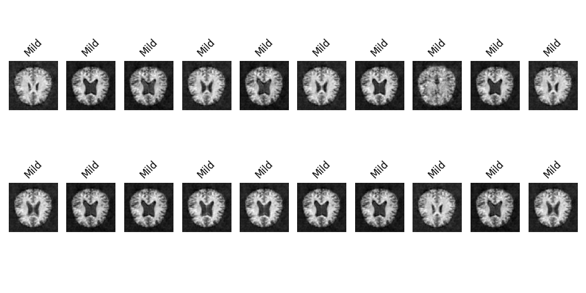

# AC-GAN - Generative Adversarial Network for Custom Dataset: Auxiliary Classifier GAN



## Overview

AC-GAN (GAN-based Project for Synthesizing Gray-scale/RGB images) is a machine learning project focused on generating synthetic images with labels using Generative Adversarial Networks (GANs). Specifically, it is designed to work with the Custom medical dataset, a large database of medical commonly used for training various image processing systems.

## Demo - During training


## Features

- Utilizes PyTorch for implementing GAN models.
- Provides scripts for easy training and generating synthetic images.
- Command Line Interface for easy interaction.
- Includes a custom data loader for the custom medical image dataset.
- Customizable training parameters for experimenting with GAN.

## Installation

Clone the repository:

```
git clone https://github.com/atikul-islam-sajib/AC-GAN.git
cd AC-GAN
```

# Install dependencies

```
pip install -r requirements.txt
```

## Usage

Examples of commands - test and their explanations(Do the training and testing).

```bash
python /path/to/AC-GAN/src/cli--test.py --help
```

Examples of commands - mimic and their explanations(Creating the synthetic data).

```bash
python /path/to/AC-GAN/src/cli--mimic.py --help
```

### Options

| Argument          | Description                                               | Type     | Default |
| ----------------- | --------------------------------------------------------- | -------- | ------- |
| `--dataset`       | Path to the zip file containing the dataset.              | `str`    | None    |
| `--image_size`    | Size of the images to be used.                            | `int`    | 64      |
| `--batch_size`    | Number of images per training batch.                      | `int`    | 64      |
| `--normalized`    | Flag indicating if images should be normalized.           | `bool`   | True    |
| `--num_epochs`    | The number of epochs for training.                        | `int`    | 200     |
| `--latent_space`  | Dimensionality of the latent space.                       | `int`    | 50      |
| `--in_channels`   | The number of input channels for the model.               | `int`    | 1       |
| `--learning_rate` | Learning rate for the optimizer.                          | `float`  | 0.0002  |
| `--beta1`         | The beta1 parameter for the Adam optimizer.               | `float`  | 0.5     |
| `--display`       | Whether to display training progress and output images.   | `bool`   | True    |
| `--device`        | The device to run the model on ('cuda', 'cpu', or 'mps'). | `str`    | "cuda"  |
| `--train`         | Flag to initiate training mode.                           | `action` | N/A     |
| `--test`          | Flag to initiate testing mode.                            | `action` | N/A     |
| `--model_path`    | Path to the pre-trained model for testing.                | `str`    | None    |
| `--num_samples`   | Number of samples to generate during testing.             | `int`    | 4       |
| `--label`         | Label for the samples to be generated during testing.     | `int`    | 0       |

## Training and Generating Images - CLI

#### Training the GAN Model with CUDA, MPS, CPU

| Action       | Device | Command                                                                                                                                                                                                         |
| ------------ | ------ | --------------------------------------------------------------------------------------------------------------------------------------------------------------------------------------------------------------- |
| **Training** | CUDA   | `python cli_script.py --train --dataset path/to/dataset.zip --image_size 64 --batch_size 64 --num_epochs 200 --latent_space 50 --in_channels 1 --learning_rate 0.0002 --beta1 0.5 --display True --device cuda` |
|              | MPS    | `python cli_script.py --train --dataset path/to/dataset.zip --image_size 64 --batch_size 64 --num_epochs 200 --latent_space 50 --in_channels 1 --learning_rate 0.0002 --beta1 0.5 --display True --device mps`  |
|              | CPU    | `python cli_script.py --train --dataset path/to/dataset.zip --image_size 64 --batch_size 64 --num_epochs 200 --latent_space 50 --in_channels 1 --learning_rate 0.0002 --beta1 0.5 --display True --device cpu`  |
| **Testing**  | CUDA   | `python cli_script.py --test --model_path path/to/model.pth --num_samples 4 --label 0 --latent_space 50 --device cuda`                                                                                          |
|              | MPS    | `python cli_script.py --test --model_path path/to/model.pth --num_samples 4 --label 0 --latent_space 50 --device mps`                                                                                           |
|              | CPU    | `python cli_script.py --test --model_path path/to/model.pth --num_samples 4 --label 0 --latent_space 50 --device cpu`                                                                                           |

#### Generating the Mimic Data

| Device | Command                                                                 |
| ------ | ----------------------------------------------------------------------- |
| CPU    | `python cli_mimc.py --device cpu --latent_space 50 --num_samples 3000`  |
| CUDA   | `python cli_mimc.py --device cuda --latent_space 50 --num_samples 3000` |
| MPS    | `python cli_mimc.py --device mps --latent_space 50 --num_samples 3000`  |

Make sure to the synthetic data would be stored in image (png) format in `/data/mimic_data` folder.

## Training and Generating Images - Importing the Modules

### Using CUDA

To leverage CUDA for accelerated computing, follow the instructions below. This setup is ideal for training and testing models with NVIDIA GPUs, ensuring fast processing and efficient handling of large datasets.

**Prerequisites:**

- Ensure CUDA-compatible hardware is available and properly configured.
- Verify that the necessary CUDA drivers and libraries are installed on your system.

**Script Execution:**

1. **Data Preparation:**

   - Initialize and configure the data loader for image preprocessing and dataset creation.

   ```python
   from src.dataloader import Loader

   loader = Loader(image_path="/path/to/dataset.zip", batch_size=64, image_size=64, normalized=True)
   loader.unzip_images()
   dataloader, labels = loader.create_dataloader()
   ```

2. **Model Training:**

   - Set up and initiate the training process using specified parameters.

   ```python
   from src.trainer import Trainer

   trainer = Trainer(image_size=64, num_epochs=200, latent_space=50, in_channels=1, learning_rate=0.0002, beta1=0.5, display=True, device="cuda")
   trainer.train()
   ```

3. **Model Testing:**

   - Execute model testing to evaluate performance and generate synthetic images.

   ```python
   from src.test import Test

   test = Test(best_model_path="/checkpoints/best_models/netG_51.pth", num_samples=50, label=0, latent_space=100, device="cuda")
   test.test()
   test.create_gif_file()
   ```

4. **Synthetic Data Generation:**

   - Generate a synthetic dataset using the trained model.

   ```python
   from src.mimic import MimicSamples

   mimic = MimicSamples(model_path="/checkpoints/best_models/netG_51.pth", latent_space=50, device="cuda", num_samples=3000)
   mimic.generate_mimic_samples()
   ```

   The generated samples will be saved in the "data/mimic_data" folder.

### Using MPS

For leveraging MPS on Apple's hardware for efficient computing, follow these steps. This approach is optimized for macOS devices equipped with Apple Silicon or other compatible GPUs.

**Prerequisites:**

- Ensure your macOS device supports MPS and is equipped with compatible hardware.
- Confirm that your environment is set up to utilize MPS for PyTorch or other machine learning frameworks.

**Script Execution:**

The steps are similar to those for CUDA, with the device parameter set to `"mps"` in all relevant instances. This ensures that MPS is utilized for all computational tasks.

### Using CPU

To execute the training and generation processes on a CPU, follow the outlined steps. This setup is universally applicable but may lead to longer processing times compared to CUDA or MPS.

**Prerequisites:**

- No specific hardware requirements other than a functional CPU.
- Ensure your Python environment is correctly set up with all required libraries installed.

**Script Execution:**

The procedure remains consistent with the CUDA and MPS sections, with the device parameter adjusted to `"cpu"`. This configuration directs all computations to be processed by the CPU.

## Documentation

For detailed documentation on the implementation and usage, visit the -> [AC-GAN Documentation](https://atikul-islam-sajib.github.io/AC-GAN-deploy/).

## Contributing

Contributions to improve the project are welcome. Please follow the standard procedures for contributing to open-source projects.

## License

This project is licensed under [MIT LICENSE](./LICENSE). Please see the LICENSE file for more details.

## Acknowledgements

Thanks to all contributors and users of the LSGAN project. Special thanks to those who have provided feedback and suggestions for improvements.

## Contact

For any inquiries or suggestions, feel free to reach out to [atikulislamsajib137@gmail.com].

## Additional Information

- This project is a work in progress and subject to changes.
- Feedback and suggestions are highly appreciated.
- Courtesy: Atikul Islam Sajib
